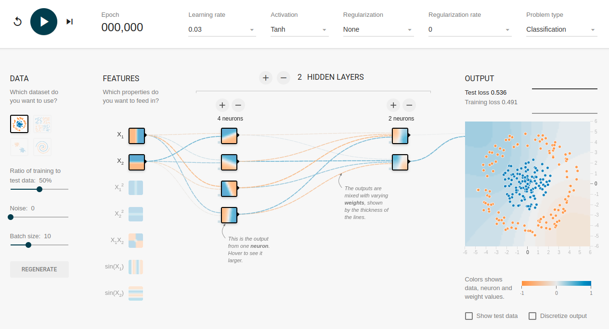

# Neural Networks

Quote: If you can't build it, you don't understand it.

The goal of this repository is to build something like [Googles Tensorflow Playground](https://playground.tensorflow.org/) from scratch using NumPy. The focus lies on the algorithms and not so much on the UI.

## TODO
[x] Forward pass  
[x] Backward pass  
[x] Activation functions  
&nbsp;&nbsp;&nbsp;&nbsp;&nbsp;&nbsp;[x] ReLU  
&nbsp;&nbsp;&nbsp;&nbsp;&nbsp;&nbsp;[&nbsp;&nbsp;] Sigmoid  
&nbsp;&nbsp;&nbsp;&nbsp;&nbsp;&nbsp;[&nbsp;&nbsp;] Softmax  
&nbsp;&nbsp;&nbsp;&nbsp;&nbsp;&nbsp;[&nbsp;&nbsp;] TanH  
[&nbsp;&nbsp;] Loss/Cost functions  
&nbsp;&nbsp;&nbsp;&nbsp;&nbsp;&nbsp;[x] L1 loss  
&nbsp;&nbsp;&nbsp;&nbsp;&nbsp;&nbsp;[x] L2 loss  
&nbsp;&nbsp;&nbsp;&nbsp;&nbsp;&nbsp;[&nbsp;&nbsp;] Softmax loss  
&nbsp;&nbsp;&nbsp;&nbsp;&nbsp;&nbsp;[&nbsp;&nbsp;] Cross-Entropy loss  
[&nbsp;&nbsp;] Optimizers  
&nbsp;&nbsp;&nbsp;&nbsp;&nbsp;&nbsp;[&nbsp;&nbsp;] Stochastic gradient descent  
&nbsp;&nbsp;&nbsp;&nbsp;&nbsp;&nbsp;[&nbsp;&nbsp;] Batch gradient descent  
&nbsp;&nbsp;&nbsp;&nbsp;&nbsp;&nbsp;[&nbsp;&nbsp;] Minibatch gradient descent  
&nbsp;&nbsp;&nbsp;&nbsp;&nbsp;&nbsp;[&nbsp;&nbsp;] Momentum  
&nbsp;&nbsp;&nbsp;&nbsp;&nbsp;&nbsp;[&nbsp;&nbsp;] RMSProp  
&nbsp;&nbsp;&nbsp;&nbsp;&nbsp;&nbsp;[&nbsp;&nbsp;] Adam  
[&nbsp;&nbsp;] Visualization  
&nbsp;&nbsp;&nbsp;&nbsp;&nbsp;&nbsp;[&nbsp;&nbsp;] x: time, y: loss  
[&nbsp;&nbsp;] Convolutional Neural Networks  
&nbsp;&nbsp;&nbsp;&nbsp;&nbsp;&nbsp;[&nbsp;&nbsp;] convolutional layers  
&nbsp;&nbsp;&nbsp;&nbsp;&nbsp;&nbsp;[&nbsp;&nbsp;] pooling layers  
[&nbsp;&nbsp;] Regularization  
&nbsp;&nbsp;&nbsp;&nbsp;&nbsp;&nbsp;[&nbsp;&nbsp;] L1 regularization  
&nbsp;&nbsp;&nbsp;&nbsp;&nbsp;&nbsp;[&nbsp;&nbsp;] L2 regularization  
[&nbsp;&nbsp;] Weight initialization  
&nbsp;&nbsp;&nbsp;&nbsp;&nbsp;&nbsp;[&nbsp;&nbsp;] Ones  
&nbsp;&nbsp;&nbsp;&nbsp;&nbsp;&nbsp;[&nbsp;&nbsp;] Zeros  
&nbsp;&nbsp;&nbsp;&nbsp;&nbsp;&nbsp;[&nbsp;&nbsp;] Random Normal initialization  
&nbsp;&nbsp;&nbsp;&nbsp;&nbsp;&nbsp;[&nbsp;&nbsp;] Xavier initialization  
[&nbsp;&nbsp;] Dropout  
[&nbsp;&nbsp;] Normalization  
&nbsp;&nbsp;&nbsp;&nbsp;&nbsp;&nbsp;[&nbsp;&nbsp;] Batch norm  
&nbsp;&nbsp;&nbsp;&nbsp;&nbsp;&nbsp;[&nbsp;&nbsp;] Layer norm  
&nbsp;&nbsp;&nbsp;&nbsp;&nbsp;&nbsp;[&nbsp;&nbsp;] Instance norm  
&nbsp;&nbsp;&nbsp;&nbsp;&nbsp;&nbsp;[&nbsp;&nbsp;] Group norm  
[&nbsp;&nbsp;] Attention layer  
[&nbsp;&nbsp;] Simplify code by reimplementing library with JAX instead of NumPy  
[&nbsp;&nbsp;] Implement traditional machine learning algorithms (regression, KNN, SVM, etc.)  